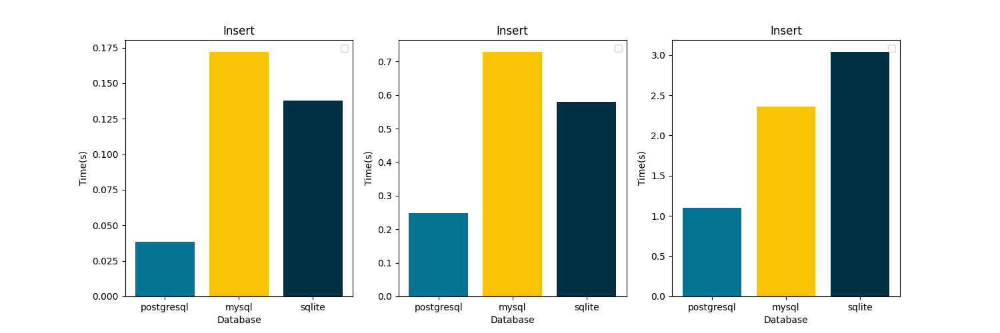
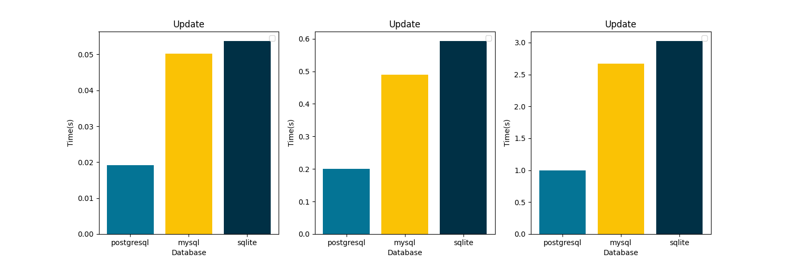
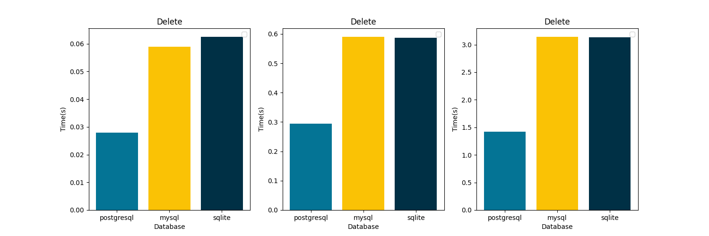

#  Сравнение СУБД

- Postgresql 
- MySQL
- SQLite

### _**Для каждого параметра представлены 3 графика -- 10 строк, 100 строк, 500 строк в таблице.**_

## Insert

## Update

## Get all

### Get by login

## Delete

## Выводы
Postgresql выигрывает по времени работы по всем параметрам, кроме получения записи по значению и получения всех записей.
Так как основными операциями в ПО, для которого проводится исследование, являются изменение, добавление и удаление записи, выбор postgresql является оправданным.

При этом SQLite быстрее конкурентов выполняет получение записи по значению. 
В приложениях, где эта операция является самой частой, эта СУБД может быть более оптимальным решением.
